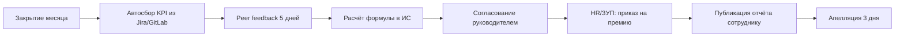

# DZ_CHANGES: внедрение процессных изменений (модель Коттера, 8 шагов)

**Источники:** вебинар `2026_06_02_CTO.pdf` (оргструктура, мотивация, McKinsey-трансформация), открытые данные об [АТОЛ](https://www.tadviser.ru/index.php/%D0%9A%D0%BE%D0%BC%D0%BF%D0%B0%D0%BD%D0%B8%D1%8F:%D0%90%D0%A2%D0%9E%D0%9B), [ТК РФ ст. 135](https://pravo.ppt.ru/kodeks/tk/st-135), контекст кейса из `FAQ_ATOL.md`.

**Модель управления изменениями:** 8 шагов Дж. Коттера (см. инфографику OTUS):

| № | Шаг |
|---|-----|
| 1 | Создать атмосферу безотлагательности и перемен |
| 2 | Сформировать влиятельные команды реформаторов |
| 3 | Создать видение изменений |
| 4 | Донести новое видение до всех |
| 5 | Создать условия для реализации нового видения |
| 6 | Показать быстрые победы |
| 7 | Закрепить изменения |
| 8 | Встроить изменения в корпоративную культуру |

---

## 1. Контекст компании АТОЛ

**АТОЛ** — российская IT-компания (с 2001 г.), разработчик и производитель оборудования и ПО для автоматизации ритейла, HoReCa, логистики: онлайн-кассы (54-ФЗ), смарт-терминалы, ПО Frontol, сеть из 2000+ партнёров. По открытым данным, численность ООО «АТОЛ» — около **238 сотрудников** ([audit-it.ru](https://www.audit-it.ru/contragent/1165010050590_ooo-atol)), штаб-квартира — Москва.

**IT-блок** развивает продуктовые и платформенные решения (кассовое ПО, облачные сервисы, интеграции). Для такой компании типичны:

- матричная / функционально-проектная оргструктура (см. `2026_06_02_CTO.pdf`: при росте — переход от бригадной к функциональной/матричной модели);
- сочетание продуктовых команд и централизованных функций (DevOps, data, HR);
- дискуссия о структуре дохода: фикс + переменная часть (в т.ч. схема 60/40, упомянутая в переговорном контексте `FAQ_ATOL.md`).

**Заданное изменение:** перейти к **гибкому формированию ежемесячной премиальной части** зарплаты IT-блока по модели: *«сотрудник сам называет в ИС зарплату, коллеги утверждают — он её получает»*.

---

## 2. Уже реализованное изменение: ретроспективный анализ

### 2.1. Описание изменения (опыт из практики)

В одной из предыдущих организаций было внедрено **процессное изменение в Delivery**: переход от гибридного Kanban с ручным QA к **Scrum-ритму (2-недельные спринты) + автоматизация CI/CD и E2E-тестов** (см. `DZ.md`). Цель — сократить cycle time, снизить долю ручного тестирования (15–20% времени) и убрать bottlenecks на внешних API.

**Связанные процессы (взаимосвязь):**

```
Roadmap/OKR → Sprint Planning → Dev → Code Review → CI/CD → QA (auto) → Deploy → Monitoring
     ↑                                              ↓
Закупки облака/API ←─────────────────────────── Incident/Retro
```

Изменение затронуло: планирование, разработку, тестирование, релиз, закупки (контракты на облако с SLA), мотивацию (прозрачные KPI спринта).

### 2.2. Оценка внедрения по 8 шагам Коттера

#### Шаг 1. Создать атмосферу безотлагательности и перемен

**Что сделано:** зафиксированы метрики боли — ручной QA 15–20% времени, задержки API до 2 дней, нерегулярные релизы. Руководство показало риск: при росте нагрузки текущая модель не масштабируется (аналог кейса CTO: «предприятие в существующем виде не справится с объёмами»).

**Оценка:** **7/10** — срочность была аргументирована данными, но не все команды одинаково ощутили «горящую платформу»; часть восприняла Scrum как бюрократию.

#### Шаг 2. Сформировать влиятельные команды реформаторов

**Что сделано:** коалиция из tech lead, DevOps, 2 product owner'ов и Scrum Master; «играющий тренер» (принцип из `2026_06_02_CTO.pdf`) лично участвовал в настройке пайплайна.

**Оценка:** **8/10** — коалиция была сильной технически, но слабо представлен HR и финансы (риск для последующих изменений мотивации).

#### Шаг 3. Создать видение изменений

**Видение:** «Релиз ценности еженедельно, ручной QA < 10%, предсказуемый sprint commitment».

**Оценка:** **8/10** — видение измеримое, но недостаточно связано с бизнес-метриками (выручка, SLA клиентов).

#### Шаг 4. Донести новое видение до всех

**Что сделано:** all-hands, wiki с Definition of Done, демо спринтов.

**Оценка:** **6/10** — инженеры поняли; смежники (закупки, поддержка) подключились поздно → конфликты на границах процессов.

#### Шаг 5. Создать условия для реализации нового видения

**Что сделано:** GitHub Actions, Playwright, выделенное время на техдолг в спринте, RACI по релизам.

**Оценка:** **7/10** — инструменты даны, но не хватило обучения (критерий матричной структуры из CTO: «необходимо обучение сотрудников»).

#### Шаг 6. Показать быстрые победы

**Quick wins:** за 1–2 спринта — автотесты на критичный флоу, сокращение ручного QA ~30%, первый blue-green deploy.

**Оценка:** **9/10** — быстрые победы убедили скептиков (принцип «доски почёта / прозрачные KPI» из блока мотивации CTO).

#### Шаг 7. Закрепить изменения

**Что сделано:** регламент релиза, quality gate в CI, ретро как обязательный ритуал.

**Оценка:** **7/10** — процесс закреплён в LNA команды, но не во всех ЛНА компании.

#### Шаг 8. Встроить изменения в корпоративную культуру

**Оценка:** **5/10** — на уровне команд культура «continuous delivery» прижилась частично; при смене руководителя тренд ослаб. **Вывод:** без шага 8 изменение остаётся «проектом», а не нормой.

### 2.3. Итог по реализованному изменению

| Критерий | Вывод |
|----------|-------|
| Эффективность внедрения | **Средне-высокая** (≈70%): технические цели достигнуты, культурная фиксация — слабое место |
| Оптимальность процесса | **Частично оптимален**; улучшения: связать sprint KPI с бизнес-OKR, формализовать кросс-функциональные SLA, встроить в политику мотивации |
| Компетенции | Операционное управление (метрики, ритуалы), проектирование процессов (BPMN-поток), взаимосвязь (delivery ↔ закупки ↔ мониторинг), внедрение (Коттер 1–6), анализ (bottleneck QA/API) |

---

## 3. Анализ предлагаемого изменения в АТОЛ: «сотрудник сам называет зарплату, коллеги утверждают»

### 3.1. Наивная модель (как в задании)

```
Сотрудник → ИС: вводит желаемую сумму премии
     ↓
Коллеги → голосование/утверждение
     ↓
При majority approve → выплата
```

### 3.2. Правовой анализ (законодательство РФ)

| Аспект | Норма | Оценка наивной модели |
|--------|-------|----------------------|
| Фиксация оплаты труда | **ст. 57, 129, 135 ТК РФ** — размер оклада и условия премий в трудовом договоре и ЛНА ([ст. 135 ТК РФ](https://pravo.ppt.ru/kodeks/tk/st-135)) | ❌ Сотрудник **не вправе** самостоятельно устанавливать размер входящей в систему оплаты труда премии; это прерогатива работодателя |
| Премия как часть ЗП | Премия в системе оплаты труда ≠ разовое поощрение по ст. 191 ТК ([ГАРАНТ](https://www.garant.ru/consult/work_law/2077665/)) | ❌ «Утверждение коллегами» не заменяет ЛНА и приказ работодателя |
| Равенство оплаты | **ст. 132 ТК РФ** — равная оплата за равный труд | ⚠️ Риск дискриминации и необоснованных различий при «самоназначении» |
| Порядок с 01.09.2025 | ФЗ № 144-ФЗ: виды, размеры, сроки, основания премий — в ЛНА; снижение при взыскании ≤ 20% месячной ЗП ([mip-expert.ru](https://mip-expert.ru/articles/oplata-truda/algoritm-deystviy-rabotodatelya-v-svyazi-s-novym-poryadkom-premirovaniya-s-1-sentyabrya-2025-goda/)) | ❌ Модель не описывает основания, периодичность, депремирование |
| НДФЛ, взносы | Премия облагается как заработная плата | ⚠️ Нужен регламент начисления в 1С/ЗУП, а не произвольный ввод |
| Персональные данные | ФИО, оценки коллег | ⚠️ Нужна политика обработки ПДн и этика peer-review |
| Коллективный договор / профсоюз | **ст. 372 ТК РФ** — учёт мнения представительного органа при ЛНА | ⚠️ Обязательный этап при введении новой системы премирования |

**Вывод по праву:** в чистом виде модель **незаконна и нежизнеспособна** в РФ. Юридически допустим **гибкий peer-informed бонус**: коллеги дают **входные оценки** (вклад, collaboration, delivery), а **итоговый размер премии** рассчитывает работодатель по утверждённой формуле в Положении о премировании.

### 3.3. Оценка наивной модели по 8 шагам Коттера (если бы внедряли «как есть»)

| Шаг | Критерий «сделано верно» | Оценка наивной модели |
|-----|--------------------------|----------------------|
| 1. Срочность | Понятна боль: непрозрачная премия, демотивация IT | ✅ Боль есть (FAQ_ATOL: 60/40, непрогнозируемая переменная часть) |
| 2. Коалиция | HR + CFO + IT-директор + профсоюз + лидеры команд | ❌ Не предусмотрена |
| 3. Видение | Законная, измеримая, справедливая система | ❌ Видение = «анархия зарплат» |
| 4. Коммуникация | Объяснение формулы, апелляции, FAQ | ❌ |
| 5. Условия | ИС, ЛНА, интеграция с ЗУП, обучение | ❌ Только «ИС для ввода суммы» |
| 6. Quick wins | Пилот в 1 команде, прозрачный отчёт | ❌ |
| 7. Закрепление | Положение о премировании, аудит | ❌ |
| 8. Культура | Доверие, обратная связь, не «торг зарплатой» | ❌ Риск токсичной конкуренции |

**Итог:** наивная реализация **не соответствует** ни законодательству, ни модели Коттера. Процесс **не оптимален**; требуется перепроектирование.

---

## 4. Оптимальный процесс: как должен выглядеть новый процесс (и почему)

### 4.1. Целевая модель: «Гибкая peer-informed премия IT» (GPIP)

**Принципы** (из `2026_06_02_CTO.pdf`):

- мотивация на 3 уровнях: **сотрудник / команда / организация**;
- персонализация без произвола;
- прозрачные KPI и «доски достижений»;
- реактивность поощрения (связь с результатом периода);
- работодатель несёт финансовую ответственность.

**Структура дохода IT-блока:**

| Компонент | Доля (ориентир) | Основание |
|-----------|-----------------|-----------|
| Оклад (фикс) | 60–70% | Трудовой договор, ст. 57 ТК РФ |
| Ежемесячная премия (переменная) | 20–30% | Положение о премировании, формула |
| Квартальный бонус (опционально) | 0–10% | Цели IT-блока / продукта |

**Формула ежемесячной премии (пример):**

```
Премия = База_премии × (0.4 × KPI_индивид + 0.3 × KPI_команды + 0.3 × Peer_Index) × K_директор
```

Где:

- **KPI_индивид** — delivery (закрытые задачи, качество, инциденты) из Jira/GitLab;
- **KPI_команды** — velocity, SLA, NPS внутренних заказчиков;
- **Peer_Index** — нормированная оценка коллег (не сумма денег!): collaboration, mentorship, code review (шкала 1–5, анонимный/полуоткрытый цикл);
- **K_директор** — коэффициент 0.8–1.2 по решению руководителя в рамках ЛНА (с обоснованием);
- **База_премии** — % от оклада, зафиксированный в Положении.

**Процесс в ИС (ежемесячный цикл):**



**Почему это лучше наивной модели:**

1. **Законность** — премия по ЛНА, приказ работодателя, прозрачные основания.
2. **Справедливость** — peer input влияет на коэффициент, но не заменяет HR-процесс.
3. **Связь с процессами** — KPI из delivery (связь с разделом 2), а не субъективный «торг».
4. **Мотивация** (Герцберг/Маккелланд из CTO): признание коллег + измеримый результат.
5. **Управляемость** — бюджет премий задаёт CFO; потолок на команду/отдел.

### 4.2. Взаимосвязь процессов

| Процесс | Связь с GPIP |
|---------|--------------|
| Agile Delivery (спринты) | Источник KPI_индивид и KPI_команды |
| Performance Review (квартал) | Калибровка весов, карьерные решения |
| HR / Положение о премировании | Правовая рамка, приказы |
| Финансы / бюджет IT | Лимит фонда премирования |
| ИБ / ПДн | Хранение peer-оценок |
| Найм / онбординг | Объяснение формулы на старте (снижает риск из `FAQ_ATOL.md`) |

---

## 5. План внедрения GPIP в АТОЛ по 8 шагам Коттера

### Шаг 1. Создать атмосферу безотлагательности и перемен

**Действия:**

- Провести аудит текущей схемы 60/40 (или аналог): % сотрудников, не понимающих переменную часть (опрос, интервью с IT).
- Показать стоимость бездействия: отток после испытательного, повторные переговоры по офферу, потеря velocity.
- Сформулировать «burning platform»: «Без прозрачной премии мы теряем tech lead'ов и не масштабируем data/platform команды».

**Артефакты:** отчёт HR + метрики текучести IT за 12 мес., бенчмарк рынка RetailTech.

**Критерий успеха:** ≥70% IT-руководителей согласны, что изменение нужно в течение 2 кварталов.

---

### Шаг 2. Сформировать влиятельные команды реформаторов

**Состав коалиции:**

| Роль | Участник | Зона |
|------|----------|------|
| Sponsor | CTO / директор IT | Бюджет, видение |
| Process owner | HR BP IT | ЛНА, трудовые риски |
| Finance | CFO / контролёр | Фонд премирования |
| Tech | Tech lead data/platform | ИС, интеграции |
| Legal | Юрист | ТК РФ, 144-ФЗ |
| Voice of employee | 2 тимлида + 1 профсоюз/представитель | Обратная связь |

**Принцип из CTO:** мотивировать «лояльных адвокатов изменений», не пытаться убедить всех сразу.

**Критерий успеха:** charter коалиции, еженедельный steering 8 недель.

---

### Шаг 3. Создать видение изменений

**Видение (1 слайд):**

> «Каждый IT-специалист АТОЛ понимает, за что он получил премию в этом месяце; 30% премии отражает вклад, признанный командой; 100% расчётов — по формуле в Положении о премировании».

**Связь с оргцелями АТОЛ:** скорость вывода фич Frontol/облака, качество релизов, удержание инженеров.

**Критерий успеха:** видение утверждено советом директоров / управляющим комитетом IT.

---

### Шаг 4. Донести новое видение до всех

**Каналы:**

- All-hands IT (30 мин + Q&A).
- Wiki: «Как считается моя премия» с примерами цифр.
- FAQ для тимлидов (шаблоны 1:1).
- Сессия с профсоюзом (ст. 372 ТК РФ).

**Антипаттерн:** не обещать «вы сами ставите зарплату» — это создаёт ложные ожидания.

**Критерий успеха:** ≥80% IT прошли onboarding по новой схеме (LMS-метрика).

---

### Шаг 5. Создать условия для реализации нового видения

**Организационные:**

- Утвердить **Положение о премировании IT-блока** (виды, формула, период, основания, апелляции).
- Внести изменения в трудовые договоры / доп. соглашения (при необходимости).
- Утвердить бюджет премий на год (помесячная разбивка).

**Технические:**

- MVP ИС: модуль peer-feedback + импорт KPI из Jira/GitLab + расчёт + отчёт сотруднику.
- Интеграция с 1С:ЗУП (приказ на премию).

**Обучение** (урок CTO: матричная структура требует обучения):

- Тимлиды: калибровка peer-оценок, bias training.
- HR: новый цикл начисления.

**Критерий успеха:** ЛНА зарегистрирован, ИС в staging, 2 команды обучены.

---

### Шаг 6. Показать быстрые победы

**Пилот (6–8 недель):** 1 продуктовая команда (15–25 чел.), например platform/data.

**Quick wins:**

- Первый прозрачный расчёт премии с расшифровкой по компонентам.
- Снижение обращений «почему мне начислили X» на 50% vs контрольная команда.
- Публикация anonymized dashboard: средний Peer_Index по командам.

**Критерий успеха:** eNPS команды-пилота не ниже baseline; 0 трудовых претензий по премии.

---

### Шаг 7. Закрепить изменения

**Действия:**

- Rollout на весь IT-блок (волнами по 2 команды/месяц).
- Включить соблюдение процесса GPIP в цели тимлидов.
- Ежеквартальный аудит: соответствие расчётов ЛНА, выборочная проверка юристом.
- Ретроспектива формулы: корректировка весов (0.4/0.3/0.3) по данным.

**Критерий успеха:** 100% IT на GPIP через 2 квартала после пилота; документированные уроки.

---

### Шаг 8. Встроить изменения в корпоративную культуру

**Действия:**

- Peer-feedback и прозрачность KPI — часть онбординга и испытательного срока (связь с 30/60/90 из `FAQ_ATOL.md`).
- Ежегодная «неделя прозрачности»: разбор формулы, истории успеха, награды за mentorship.
- Связать с карьерными треками (принцип «продаём будущее» из CTO: профессиональное, внутри компании, вне компании).
- Убрать параллельные неформальные схемы («договорились на словах»).

**Критерий успеха:** GPIP упоминается в корпоративных ценностях IT; текучесть ↓, время закрытия вакансий ↓.

---

## 6. Дорожная карта (сводка)

| Фаза | Срок | Шаги Коттера | Результат |
|------|------|--------------|-----------|
| Диагностика | Нед. 1–4 | 1 | Отчёт, срочность |
| Дизайн | Нед. 5–10 | 2–3 | ЛНА draft, видение |
| Подготовка | Нед. 11–16 | 4–5 | Коммуникация, ИС MVP |
| Пилот | Нед. 17–24 | 6 | Quick wins |
| Масштабирование | Мес. 7–9 | 7 | Rollout IT |
| Культура | Мес. 10–12 | 8 | Онбординг, аудит |

---

## 7. Риски и митигация

| Риск | Вероятность | Митигация |
|------|-------------|-----------|
| Трудовой спор по премии | Средняя | ЛНА + приказ + расшифровка в ИС |
| Токсичный peer-review | Средняя | Анонимность, калибровка, cap на отклонение |
| Перерасход фонда | Низкая | Лимит на отдел, нормализация Peer_Index |
| Саботаж «старой гвардии» | Средняя | Коалиция (шаг 2), quick wins (шаг 6) |
| Несовместимость с 1С | Низкая | Пилот интеграции на шаге 5 |

---

## 8. Демонстрация компетенций (по заданию)

| Компетенция | Где проявлена в документе |
|-------------|---------------------------|
| **Операционное управление** | Метрики delivery, бюджет премий, пилот, eNPS, аудит (разделы 2, 5–6) |
| **Проектирование и построение процессов** | Целевая модель GPIP, формула, BPMN-цикл, RACI коалиции (разделы 4–5) |
| **Взаимосвязь процессов** | Карта связей Delivery ↔ HR ↔ Finance ↔ ИС (разделы 2.1, 4.2) |
| **Внедрение изменений** | Полный план по 8 шагам Коттера; ретроспектива прошлого внедрения (разделы 2, 5) |
| **Анализ информации** | Правовой анализ ТК РФ, открытые данные АТОЛ, оценка наивной vs оптимальной модели (разделы 1, 3–4) |

---

## 9. Заключение

1. **Реализованное изменение** (Scrum + CI/CD в Delivery) было внедрено **эффективно на 70%**: сильные шаги 2, 3, 6; слабые — 4 (смежники), 8 (культура).
2. **Наивная модель АТОЛ** («сотрудник сам называет зарплату») **незаконна в РФ** и не проходит критерии Коттера.
3. **Оптимальная замена** — **GPIP**: peer input как коэффициент, расчёт по ЛНА, интеграция с delivery-KPI.
4. **План внедрения** на 12 месяцев по 8 шагам Коттера с пилотом, юридическим оформлением и культурной фиксацией.

**Рекомендация для АТОЛ:** начать не с ИС для ввода суммы, а с **Положения о премировании IT** и пилота peer-informed формулы в одной команде — это согласует мотивацию (CTO), закон (ТК РФ) и операционную реальность RetailTech-компании с ~238 сотрудниками и амбициями роста платформенных продуктов.
