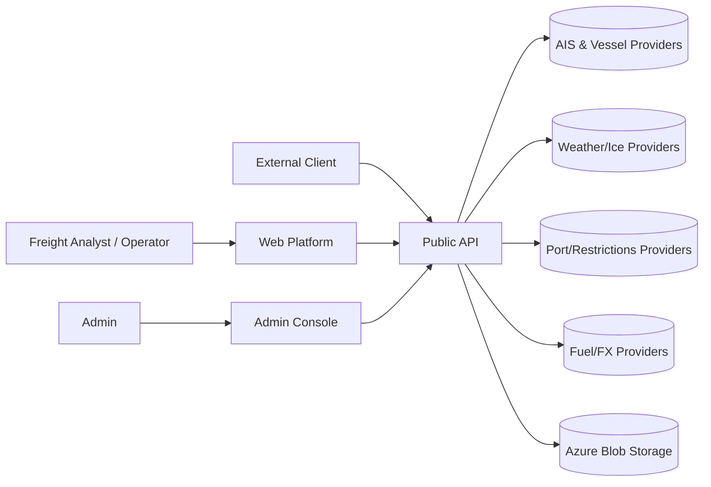
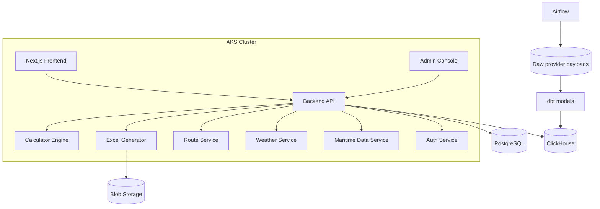
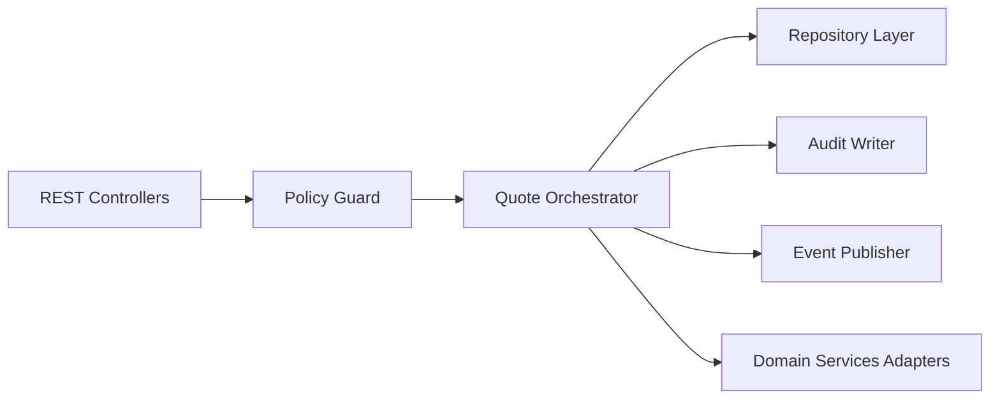
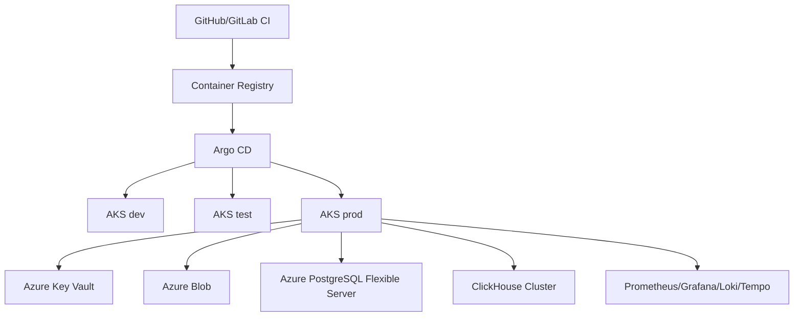

# C4 Diagrams (Mermaid)

## 1) Context

```mermaid
flowchart LR
    U[Freight Analyst / Operator] --> WEB[Web Platform]
    C[External Client] --> API[Public API]
    A[Admin] --> ADM[Admin Console]

    WEB --> API
    ADM --> API
    API --> AIS[(AIS & Vessel Providers)]
    API --> WTH[(Weather/Ice Providers)]
    API --> PRT[(Port/Restrictions Providers)]
    API --> FX[(Fuel/FX Providers)]
    API --> OBJ[(Azure Blob Storage)]
```

## 2) Container

```mermaid
flowchart TB
    subgraph AKS[AKS Cluster]
      FE[Next.js Frontend]
      BFF[Backend API]
      CALC[Calculator Engine]
      XLS[Excel Generator]
      ROUTE[Route Service]
      WEA[Weather Service]
      MAR[Maritime Data Service]
      AUTH[Auth Service]
      ADM[Admin Console]
    end

    FE --> BFF
    ADM --> BFF
    BFF --> AUTH
    BFF --> ROUTE
    BFF --> WEA
    BFF --> MAR
    BFF --> CALC
    BFF --> XLS

    BFF --> PG[(PostgreSQL)]
    BFF --> CH[(ClickHouse)]
    XLS --> BLOB[(Blob Storage)]

    AIR[Airflow] --> RAW[(Raw provider payloads)]
    RAW --> DBT[dbt models]
    DBT --> CH
```

## 3) Component (Backend API)

```mermaid
flowchart LR
    CTRL[REST Controllers]
    ORCH[Quote Orchestrator]
    POL[Policy Guard]
    AUD[Audit Writer]
    REP[Repository Layer]
    BUS[Event Publisher]

    CTRL --> POL --> ORCH
    ORCH --> REP
    ORCH --> AUD
    ORCH --> BUS
    ORCH --> EXT[Domain Services Adapters]
```

## 4) Deployment

```mermaid
flowchart TB
    GH[GitHub/GitLab CI] --> REG[Container Registry]
    REG --> ARGO[Argo CD]
    ARGO --> AKSDEV[AKS dev]
    ARGO --> AKSTEST[AKS test]
    ARGO --> AKSPROD[AKS prod]

    AKSPROD --> KV[Azure Key Vault]
    AKSPROD --> BLOB[Azure Blob]
    AKSPROD --> PGF[Azure PostgreSQL Flexible Server]
    AKSPROD --> CHN[ClickHouse Cluster]
    AKSPROD --> OBS[Prometheus/Grafana/Loki/Tempo]
```
